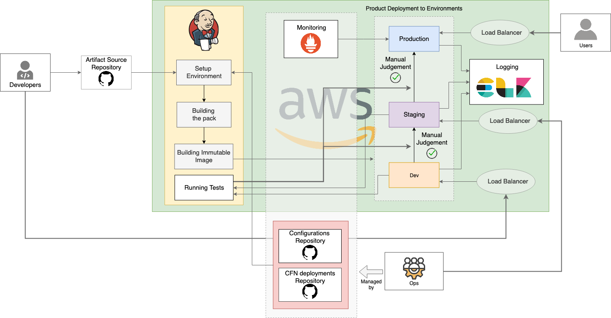

# jenkins-pipeline-artifacts

This repository contains resources for WSO2 AWS Pipeline for WSO2 products

### Overview

* WSO2 AWS pipeline provides tools and preconfigured pipeline used for continuous integration and deployment of WSO2 products. The setup is deployed on top of AWS using cloudformation.

* Pipeline has end to end automation from initiating automatics builds to deploying to differnt environments on AWS.

* Pipeline uses the AWS Jenkins Pipeline plugin that builds, tests, and deploys the code each time it is edited. This pipeline expands with continuous integration by deploying all code changes to development and staging environment and thereafter, to the production environment.

Following are the tools used to install and monitor the pipeline

    Jenkins: Continous integration

    Cloudformation: Continous deployment to AWS

    ELK: Centralized logging

    Prometheus-operator: Monitoring deployments and visualization using Grafana

### Installation
Use the following getting started guides to install AWS pipeline for the resepective WSO2 product.

* [Getting started with AWS Pipeline for WSO2 Enterprise Integrator](docs/getting-started-ei.md)

* [Getting started with AWS Pipeline for WSO2 Identity and Access Management](docs/getting-started-is.md)

* [Getting started with AWS Pipeline for WSO2 API Management](docs/getting-started-apim.md)

## Contact us

WSO2 developers can be contacted via the following mailing lists:

* WSO2 Developers Mailing List : [dev@wso2.org](mailto:dev@wso2.org)
* WSO2 Architecture Mailing List : [architecture@wso2.org](mailto:architecture@wso2.org)